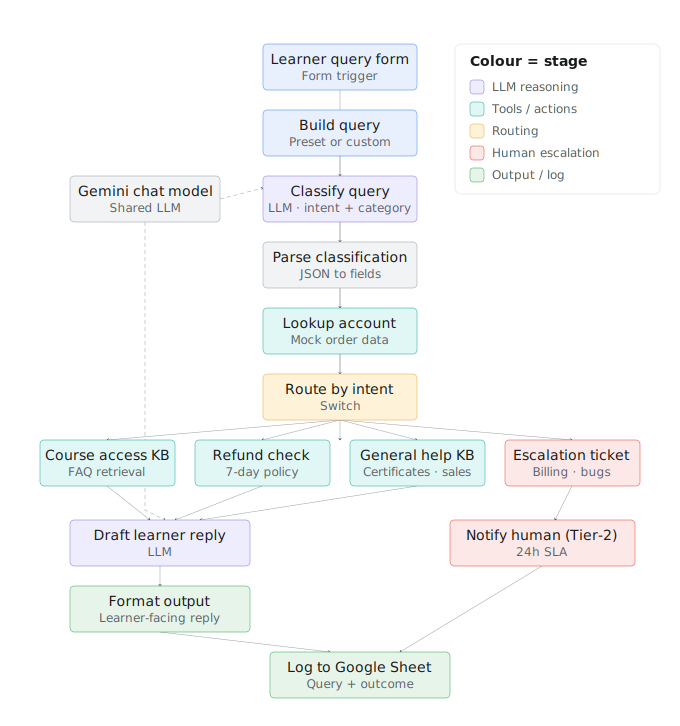

# AI Learner Support Agent

An AI assistant that handles the front line of learner support for CodeBasics — it reads a
learner's question, works out what it's about, finds the right answer, replies, and passes
genuinely tricky cases to a human.

---

## The problem it solves

Every day, the learner-support inbox fills up with repetitive questions — login problems,
refund requests, "where's my certificate?", "when is the next sale?". A small team reads each
one by hand, looks up the learner's account, and either replies or escalates. As the number of
learners grows, replies get slower.

Most of these questions can be answered from existing help information. Only a handful truly
need a person. This project automates that front line so the team can focus on the cases that
genuinely need them.

---

## What it does

When a learner sends a question, the assistant:

1. **Reads and understands it** — figures out what the question is about (e.g. a login issue or
   a refund request).
2. **Looks up the learner** — checks their account and order details.
3. **Finds the right answer** — pulls the correct response from our help information, and for
   refunds checks whether the request is inside the refund window.
4. **Replies — or escalates** — writes a friendly, ready-to-send reply for routine questions,
   or raises a ticket and hands the case to a human for genuine edge cases.
5. **Keeps a record** — logs every question and its outcome to a Google Sheet.

---

## What it handles today

| Learner asks about… | What the assistant does |
|---|---|
| Can't log in / can't access a course | Answers automatically with the fix steps |
| Wants a refund | Checks the 7-day refund window, then approves or explains the policy |
| Certificates, discounts, general questions | Answers automatically from help info |
| Billing disputes, "money deducted but payment failed", real bugs | **Sends to a human** — never auto-answered |

That last row is the safety net: anything sensitive or genuinely complex goes to a person
instead of getting an automated guess.

---

## See it in action

- **Recorded responses (live Google Sheet):**
  <https://docs.google.com/spreadsheets/d/1I6UXhehLxdKaWtf6AEYmjV15wrOKewrIB0OPDfixtHM/edit?usp=sharing>
- **Test scenarios and results:** see [`TEST_QUERIES.md`](TEST_QUERIES.md)
- **The workflow on screen:** 

---

## Built with

- **n8n** — the tool used to build the step-by-step workflow
- **Google Gemini 2.5 Flash** — the AI that understands questions and drafts replies
- **Google Sheets** — where every query and outcome is logged

It runs entirely on free tiers, so there is no running cost.

---

## What's in this repository

| File | What it is |
|---|---|
| `CodeBasics_AI_Support_Agent.json` | The actual workflow (can be imported into n8n) |
| `README.md` | This overview |
| `README_SETUP.md` | Step-by-step setup instructions (technical) |
| `TEST_QUERIES.md` | Sample test queries and their expected results |
| `REFLECTION.md` | A short reflection on what was built and learned |
| `architecture_diagram.svg` | The diagram shown above |
| `Submission - *.jpg` | Screenshots of the workflow and test runs |
